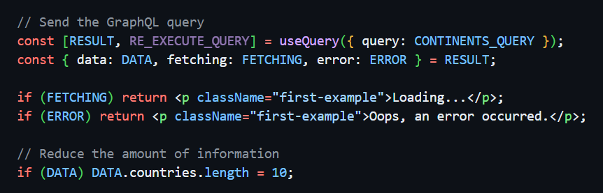

###### 📂 The main Component

# File `index.tsx`

This is the file which renders the actual Component and contains the logic that retrieves information from the GraphQL API. It uses some commands from the `urql` package in order to run queries and to expect results and responses.

The main query we're running in this file is contained inside `CONTINENTS_QUERY`, a variable which takes advantage of the `gql` method to construct a GraphQL Query within backticks, as if it was a normal string. Some who have worked with the CSS-in-JS `styled-components` package may already be familiar with this syntax.

For reference, below is the commented Query we are running against the server:

```graphql
// Queries
const CONTINENTS_QUERY = gql`

    # Add the "query" diciture before
    # the actual query. This is mandatory
    # because, outside of "query", we
    # may have other "root types", such
    # as "mutation" or "subscription"
	query {

		# Retrieve the "countries" Array
		countries {

			# For each Country, retrieve the "name"
            # and the "capital" parameters, which are
            # normal and basic strings
			name
			capital

			# For each Country, retrieve the
            # "languages" Array, which consists
            # in turn of some other parameters
			languages {
			
				# Retrieve "name" and "code"
                # for each Language in the
                # "languages" Array, which
                # are normal strings
				name
				code
				
			}

		}

	}

`;
```

<br />

### 🤞 Handle the response from the server

Below is how we handled the response from the server, using one of the built-in `urql` functions: `useQuery`.

This function returns some parameters which we can destructure and assign to our custom variables, but the one which we need most is the `RESULT` variable (that you can of course call as you prefer). Indeed, `RESULT` will be in turn destructured and will provide us some convenient variables which will almost automatically handle the various statuses of the response already by themselves.



For each of the variables coming out from the `RESPONSE`, we can conditionally print a different return statement, and easily handle the loading, error and successful states from the response. Easy, isn't it?

<br />

###### 📂 TypeScript interfaces and types

# File `types.tsx`

This is a common file when working with TypeScript. It contains the essential interfaces and types definitions for the Countries and Languages Arrays we're working with within the query above.

When a variable is associated with one of the interfaces or types defined in this file, that specific variable has to respect and reflect the shape of the corrensponding interface or type.

Given the following interface, for instance, we would have the also following corresponding object:

```typescript
// The interface defined for a Language,
// that each item in the "languages" Array
// should and must respect
export interface TLanguage {
    name: string,
    code: string
}

// An object reflecting the Language
// interface. Or better, an object
// inside which parameters must
// reflect the parameters indicated
// in its provided interface
const LANGUAGE_OBJECT: TLanguage {
    name: 'English',
    code: 'EN'
}
```